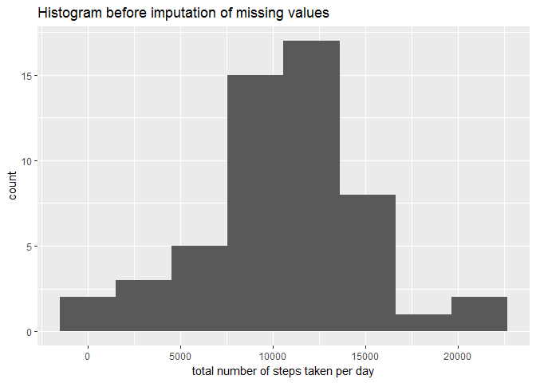

# Reproducible Research: Peer Assessment 1


## **Loading and preprocessing the data**

### Load the data
Read data with NA's

```r
if(!file.exists("activity.csv")) {
    unzip("activity.zip")
}
data_wna <- read.csv("./activity.csv")
```

### Preprocessing data
I removed the rows containing NA's.

```r
data <- na.omit(data_wna)
```


## **What is mean total number of steps taken per day?**

```r
library(dplyr)
```

### Calculate the total number of steps taken per day


```r
nStepsDay <- data %>%
    group_by(date) %>%
    summarise(totalsteps = sum(steps)) %>%
    as.data.frame()

nStepsDay
```

```
##          date totalsteps
## 1  2012-10-02        126
## 2  2012-10-03      11352
## 3  2012-10-04      12116
## 4  2012-10-05      13294
## 5  2012-10-06      15420
## 6  2012-10-07      11015
## 7  2012-10-09      12811
## 8  2012-10-10       9900
## 9  2012-10-11      10304
## 10 2012-10-12      17382
## 11 2012-10-13      12426
## 12 2012-10-14      15098
## 13 2012-10-15      10139
## 14 2012-10-16      15084
## 15 2012-10-17      13452
## 16 2012-10-18      10056
## 17 2012-10-19      11829
## 18 2012-10-20      10395
## 19 2012-10-21       8821
## 20 2012-10-22      13460
## 21 2012-10-23       8918
## 22 2012-10-24       8355
## 23 2012-10-25       2492
## 24 2012-10-26       6778
## 25 2012-10-27      10119
## 26 2012-10-28      11458
## 27 2012-10-29       5018
## 28 2012-10-30       9819
## 29 2012-10-31      15414
## 30 2012-11-02      10600
## 31 2012-11-03      10571
## 32 2012-11-05      10439
## 33 2012-11-06       8334
## 34 2012-11-07      12883
## 35 2012-11-08       3219
## 36 2012-11-11      12608
## 37 2012-11-12      10765
## 38 2012-11-13       7336
## 39 2012-11-15         41
## 40 2012-11-16       5441
## 41 2012-11-17      14339
## 42 2012-11-18      15110
## 43 2012-11-19       8841
## 44 2012-11-20       4472
## 45 2012-11-21      12787
## 46 2012-11-22      20427
## 47 2012-11-23      21194
## 48 2012-11-24      14478
## 49 2012-11-25      11834
## 50 2012-11-26      11162
## 51 2012-11-27      13646
## 52 2012-11-28      10183
## 53 2012-11-29       7047
```

### Make a histogram of the total number of steps taken per day

```r
library(ggplot2)
```


```r
ggplot(nStepsDay, aes(x = totalsteps)) + 
    geom_histogram(bins = 8) + 
    ggtitle("Histogram before imputation of missing values") +
    xlab("total number of steps taken per day")
```

<!-- -->

### Calculate and report the mean and median of the total number of steps taken per day


```r
summary <- nStepsDay %>% 
    summarise(mean = mean(totalsteps), 
              median = median(totalsteps)) %>%
    as.data.frame()

summary
```

```
##       mean median
## 1 10766.19  10765
```
Hence the <code>mean</code> is **10766** steps and the <code>median</code> is **10765** steps.

## **What is the average daily activity pattern?**

### Make a time series plot (i.e. type = "l") of the 5 minute interval (x-axis) and the average number of steps taken, averaged across all days (y-axis)

```r
# divide oberservations in groups of intervals and apply the mean to each group
stepIntervalMean <- aggregate(steps ~ interval, data, mean)
```


```r
ggplot(stepIntervalMean, aes(x = interval, y = steps)) + 
    geom_line() + 
    ylab("average number of steps taken")
```

<!-- -->


```r
# calculation of 5-minute interval where steps is maximum across all days on average
stepIntervalMean$interval[which.max(stepIntervalMean$steps)]
```

```
## [1] 835
```
Hence, the <code>interval</code> is **835**. In different notation this would be 8:35 AM. 

## **Imputing missing values**

### Calculate and report the total number of missing values in the dataset (i.e. the total number of rows with NA's)

```r
sum(!complete.cases(data_wna))
```

```
## [1] 2304
```
There are **2304** missing values in the dataset.

### Strategy for filling in all of the missing values in the data set
I replaced missing values in the dataset with the mean for that 5-minute interval. 

### Create a new dataset that is equal to the original dataset but with the missing data filled in


```r
data_new <- data_wna

data_new$steps[which(is.na(data_new$steps))] <- stepIntervalMean$steps
```

### Make a histogram of the total number of steps taken per day


```r
nStepsDay_imp <- data_new %>%
    group_by(date) %>%
    summarise(totalsteps = sum(steps)) %>%
    as.data.frame()
```


```r
ggplot(nStepsDay_imp, aes(x = totalsteps)) + 
    geom_histogram(bins = 8) + 
    ggtitle("Histogram after imputation of missing values") +
    xlab("total number of steps taken per day")
```

<!-- -->

### Calculate and report the mean and median of the total number of steps taken per day


```r
summary_imp <- nStepsDay_imp %>% 
    summarise(mean = mean(totalsteps), 
              median = median(totalsteps)) %>%
    as.data.frame()

summary_imp
```

```
##       mean   median
## 1 10766.19 10766.19
```
Hence the <code>mean</code> is **10766** steps and the <code>median</code> is **10766** steps. 

### Do these  values differ from the estimates from the first part of the assignment?
Yes, the median differs slightly from each other.

* before imputation <code>mean</code> was **10766** steps and the <code>median</code> was **10765** steps.
* after imputation <code>mean</code> is **10766** steps and the <code>median</code> is **10766** steps. 

### What is the impact of imputing missing data on estimates of the total daily number of steps?
Observations:  

*  The impact of the imputation is that the <code>median</code> moved closer to the <code>mean</code>. More strongly, they are now equal.   
* The impact of the imputation is that the count (amount of days) has increased from 17 to 25.  

## **Are there differences in activity patterns between weekdays and weekends?**

### Create a new factor variable in the dataset with two levels indicating whether a given date is a weekday or weekend day  
First we need to convert the date from factor into a date, before we can apply the <code>weekdays()</code> function. 


```r
data_new$date <- as.Date(as.character(data_new$date, format = "%Y-%m-$d"))
```

Next, we create a factor variable with levels "weekend" and "weekday".

```r
weekdays <- weekdays(data_new$date)

data_new$day_type <- ifelse(weekdays %in% c("Saturday", "Sunday"), "weekend", "weekday")

# convert to factor
data_new$day_type <- as.factor(data_new$day_type)
```

### Make a panel plot containing a time series plot of the 5-minute interval (x-axis) and the average number of steps taken, averaged across all weekday days or weekend days (y-axis).


```r
# divide oberservations in groups of intervals and apply the mean to each group
stepIntervalMean_imp <- aggregate(steps ~ interval+day_type, data_new, mean)
```


```r
p <- ggplot(stepIntervalMean_imp, aes(x = interval, y = steps)) 
p + geom_line() + facet_grid(day_type ~ .) + ylab("average number of steps taken")
```

<!-- -->
